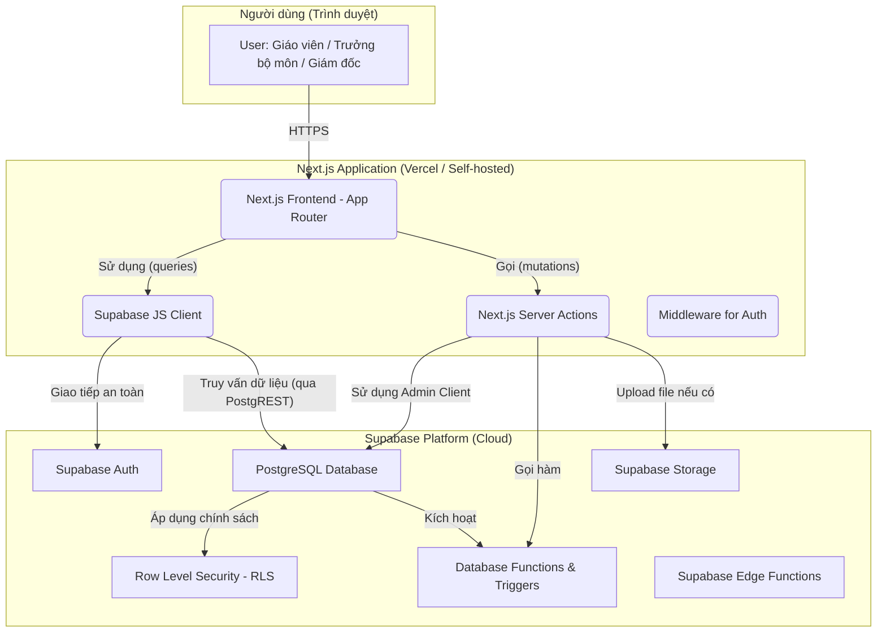

Chắc chắn rồi. Với vai trò là một Kiến trúc sư Giải pháp Cấp cao, tôi xin trình bày một bản thiết kế kiến trúc kỹ thuật toàn diện cho Hệ thống Quản lý Yêu cầu của trường học, dựa trên các yêu cầu chi tiết bạn đã cung cấp.

---

### **TÀI LIỆU THIẾT KẾ KỸ THUẬT TOÀN DIỆN**
**DỰ ÁN: HỆ THỐNG QUẢN LÝ YÊU CẦU CHO TRƯỜNG TRUNG TIỂU HỌC VIỆT ANH**

**Phiên bản:** 1.0  
**Ngày:** 10/09/2025  

### **Mục lục**
1.  Thiết kế Kiến trúc Tổng thể (High-Level Architecture)
2.  Thiết kế Backend và Cơ sở dữ liệu trên Supabase
3.  Lớp API và Luồng Dữ liệu (Sử dụng Server Actions)
4.  Thiết kế Frontend với Next.js
5.  Xác thực và Phân quyền (Authentication & Authorization)
6.  Áp dụng các Design Pattern
7.  Chiến lược Kiểm thử (Testing Strategy)
8.  Triển khai và DevOps (Deployment and DevOps)
9.  Giám sát và Ghi log (Monitoring and Logging)
10. Các Vấn đề Bảo mật (Security Considerations)
11. Tối ưu hóa Hiệu năng (Performance Optimization)
12. Khả năng Bảo trì và Tài liệu hóa (Maintainability and Documentation)

---

### **I. Thiết kế Kiến trúc Tổng thể (High-Level Architecture)**

Kiến trúc được đề xuất là một kiến trúc hiện đại, phân tách rõ ràng, tận dụng tối đa sức mạnh của hệ sinh thái Next.js và Supabase.

#### **1. Sơ đồ Kiến trúc**



**Giải thích Sơ đồ:**

1.  **Người dùng (User):** Tương tác với ứng dụng Next.js thông qua trình duyệt.
2.  **Next.js Application:**
    *   **Frontend (App Router):** Các component React Server/Client render giao diện người dùng. Tận dụng TanStack Query và Supabase JS Client để lấy dữ liệu.
    *   **Server Actions:** Là "backend trong frontend", xử lý tất cả các nghiệp vụ ghi/thay đổi dữ liệu (tạo, duyệt, từ chối yêu cầu). Chúng chạy an toàn trên server, có thể gọi trực tiếp đến Supabase bằng quyền admin (với các kiểm tra phân quyền chặt chẽ trong code) để thực thi logic nghiệp vụ phức tạp.
    *   **Supabase JS Client:** Thư viện chính để tương tác với Supabase từ phía client, chịu trách nhiệm xác thực, và thực hiện các truy vấn đọc dữ liệu tuân thủ RLS.
3.  **Supabase Platform:**
    *   **Supabase Auth:** Quản lý toàn bộ vòng đời của người dùng (đăng ký, đăng nhập, JWT sessions).
    *   **PostgreSQL Database:** Lưu trữ toàn bộ dữ liệu của ứng dụng.
    *   **Row Level Security (RLS):** Là lớp bảo mật cốt lõi, đảm bảo người dùng chỉ có thể truy cập dữ liệu được phép ngay tại tầng cơ sở dữ liệu.
    *   **Database Functions & Triggers:** Tự động hóa các logic liên quan đến luồng duyệt, giảm tải cho lớp ứng dụng.
    *   **Supabase Storage:** Lưu trữ các file đính kèm (nếu có trong tương lai).

#### **2. Tiếp cận Thiết kế Mô-đun (Modular Design)**

Hệ thống được thiết kế xoay quanh các thực thể chung (`requests`, `workflows`) để đảm bảo khả năng mở rộng.

*   **Engine Lõi:** Bảng `requests` và các bảng liên quan đến `workflows` là trái tim của hệ thống. Bảng `requests` sẽ có một cột `request_type` để phân biệt các loại yêu cầu và một cột `payload` (kiểu JSONB) để chứa dữ liệu đặc thù cho từng loại.
*   **Plug-in Module (Ví dụ: "Yêu cầu Hỗ trợ Kỹ thuật"):**
    1.  **Cấu hình DB:** Thêm một giá trị mới, ví dụ `it_support`, vào bảng `request_types`.
    2.  **Định nghĩa Workflow:** Admin tạo một luồng duyệt mới trong giao diện quản trị và gán nó cho loại `it_support`.
    3.  **Tạo Frontend Component:** Tạo một component form mới, ví dụ `ITSupportRequestForm.tsx`, để thu thập các thông tin đặc thù (vd: "Mô tả sự cố", "Mã thiết bị").
    4.  **Tạo Server Action:** Tạo một Server Action mới `createITSupportRequest` để xử lý việc ghi dữ liệu từ form vào cột `payload` của bảng `requests`.
    5.  **Áp dụng Strategy Pattern:** Một "bộ điều phối" ở frontend sẽ dựa vào `request_type` để render đúng form (ví dụ: `SupplyRequestForm` hay `ITSupportRequestForm`).

Cách tiếp cận này giúp việc thêm loại yêu cầu mới không cần thay đổi kiến trúc lõi, chỉ cần thêm các thành phần mới một cách độc lập.

#### **3. Luồng Dữ liệu Người dùng & Hệ thống (Supply Request Flow)**

1.  **Giáo viên (User Journey):** Đăng nhập -> Vào trang "Tạo yêu cầu" -> Chọn "Yêu cầu Vật tư" -> Điền form động (thêm các vật tư cần thiết) -> Nhấn "Gửi".
2.  **Hệ thống (System Flow):**
    *   Form submit gọi Server Action `createSupplyRequest`.
    *   Server Action dùng Zod để xác thực dữ liệu.
    *   Server Action ghi dữ liệu vào bảng `requests` và `request_items`.
    *   Một DB Trigger trên bảng `requests` được kích hoạt.
    *   Trigger tìm workflow tương ứng với loại "Yêu cầu Vật tư", tìm bước đầu tiên (duyệt bởi Trưởng bộ môn), và cập nhật trạng thái của yêu cầu thành `PENDING_DEPT_HEAD_APPROVAL`.
    *   Trưởng bộ môn đăng nhập, dashboard của họ thực hiện một truy vấn (qua Supabase JS Client) lấy các yêu cầu có trạng thái `PENDING_DEPT_HEAD_APPROVAL` và thuộc bộ môn của họ (RLS sẽ tự động lọc).
    *   Trưởng bộ môn mở yêu cầu, có thể chỉnh sửa danh sách vật tư và nhấn "Duyệt".
    *   Hành động "Duyệt" gọi Server Action `approveRequest`, truyền vào ID yêu cầu và các thay đổi.
    *   Server Action gọi một DB Function `handle_approval` để cập nhật trạng thái yêu cầu sang bước tiếp theo (`PENDING_DIRECTOR_APPROVAL`) và ghi lại lịch sử vào bảng `approvals` và `audit_logs`.
    *   Quy trình lặp lại cho Giám đốc.

### **II. Thiết kế Backend và Cơ sở dữ liệu trên Supabase**

#### **1. Lược đồ Cơ sở dữ liệu (SQL DDL)**

```sql
-- Bảng quản lý vai trò
CREATE TABLE roles (
    id SERIAL PRIMARY KEY,
    name TEXT NOT NULL UNIQUE
);

-- Bảng quản lý phòng ban
CREATE TABLE departments (
    id SERIAL PRIMARY KEY,
    name TEXT NOT NULL UNIQUE
);

-- Bảng mở rộng thông tin người dùng từ auth.users của Supabase
CREATE TABLE profiles (
    id UUID PRIMARY KEY REFERENCES auth.users(id),
    full_name TEXT,
    role_id INT REFERENCES roles(id),
    department_id INT REFERENCES departments(id)
);

-- Bảng loại yêu cầu (để mở rộng)
CREATE TABLE request_types (
    id SERIAL PRIMARY KEY,
    name TEXT NOT NULL UNIQUE, -- e.g., 'supply_request', 'it_support_request'
    description TEXT
);

-- Bảng workflow chính
CREATE TABLE workflows (
    id SERIAL PRIMARY KEY,
    name TEXT NOT NULL,
    request_type_id INT REFERENCES request_types(id),
    is_active BOOLEAN DEFAULT TRUE
);

-- Các bước trong một workflow
CREATE TABLE workflow_steps (
    id SERIAL PRIMARY KEY,
    workflow_id INT NOT NULL REFERENCES workflows(id),
    step_order INT NOT NULL,
    step_name TEXT NOT NULL,
    approver_role_id INT NOT NULL REFERENCES roles(id),
    can_edit BOOLEAN DEFAULT FALSE, -- Cho phép người duyệt chỉnh sửa yêu cầu
    UNIQUE(workflow_id, step_order)
);

-- Bảng yêu cầu chính (engine lõi)
CREATE TABLE requests (
    id BIGSERIAL PRIMARY KEY,
    requester_id UUID NOT NULL REFERENCES profiles(id),
    request_type_id INT NOT NULL REFERENCES request_types(id),
    workflow_id INT REFERENCES workflows(id),
    current_step_id INT REFERENCES workflow_steps(id),
    status TEXT NOT NULL, -- e.g., 'DRAFT', 'PENDING_APPROVAL', 'APPROVED', 'REJECTED'
    reason TEXT,
    needed_by_date DATE,
    created_at TIMESTAMPTZ DEFAULT NOW(),
    updated_at TIMESTAMPTZ DEFAULT NOW()
);

-- Bảng chi tiết vật tư cho một yêu cầu (hỗ trợ form động)
CREATE TABLE request_items (
    id BIGSERIAL PRIMARY KEY,
    request_id BIGINT NOT NULL REFERENCES requests(id) ON DELETE CASCADE,
    item_name TEXT NOT NULL,
    quantity NUMERIC NOT NULL,
    unit TEXT -- e.g., 'cái', 'hộp'
);

-- Bảng lịch sử phê duyệt
CREATE TABLE approvals (
    id BIGSERIAL PRIMARY KEY,
    request_id BIGINT NOT NULL REFERENCES requests(id) ON DELETE CASCADE,
    workflow_step_id INT NOT NULL REFERENCES workflow_steps(id),
    approver_id UUID NOT NULL REFERENCES profiles(id),
    decision TEXT NOT NULL, -- 'APPROVED', 'REJECTED'
    comments TEXT,
    created_at TIMESTAMPTZ DEFAULT NOW()
);

-- Bảng ghi lại lịch sử thay đổi (quan trọng cho việc chỉnh sửa)
CREATE TABLE audit_logs (
    id BIGSERIAL PRIMARY KEY,
    request_id BIGINT NOT NULL REFERENCES requests(id) ON DELETE CASCADE,
    user_id UUID REFERENCES profiles(id),
    action TEXT NOT NULL, -- e.g., 'CREATE', 'EDIT_ITEMS', 'APPROVE'
    change_details JSONB, -- { "field": "items", "old_value": [...], "new_value": [...] }
    created_at TIMESTAMPTZ DEFAULT NOW()
);

-- Thêm các chỉ mục (index) để tối ưu truy vấn
CREATE INDEX idx_requests_requester_id ON requests(requester_id);
CREATE INDEX idx_requests_status ON requests(status);
CREATE INDEX idx_request_items_request_id ON request_items(request_id);
```

#### **2. Chính sách Bảo mật Cấp hàng (Row Level Security - RLS)**

Bật RLS cho tất cả các bảng quan trọng.

```sql
-- Giáo viên chỉ thấy yêu cầu của mình
CREATE POLICY "Teachers can view their own requests"
ON requests FOR SELECT
USING (auth.uid() = requester_id);

-- Trưởng bộ môn thấy yêu cầu của giáo viên trong bộ môn
CREATE POLICY "Dept Heads can view requests from their department"
ON requests FOR SELECT
USING (
    EXISTS (
        SELECT 1 FROM profiles p_user
        WHERE p_user.id = auth.uid()
          AND p_user.role_id = (SELECT id FROM roles WHERE name = 'Department Head')
          AND p_user.department_id = (SELECT department_id FROM profiles p_req WHERE p_req.id = requests.requester_id)
    )
);

-- Giám đốc thấy tất cả
CREATE POLICY "Directors can view all requests"
ON requests FOR SELECT
USING (
    EXISTS (
        SELECT 1 FROM profiles
        WHERE id = auth.uid()
          AND role_id = (SELECT id FROM roles WHERE name = 'Director')
    )
);

-- Chính sách cho phép cập nhật (phức tạp hơn, cần kiểm tra bước duyệt hiện tại)
CREATE POLICY "Approvers can update requests at their step"
ON requests FOR UPDATE
USING (
    requests.current_step_id IN (
        SELECT ws.id FROM workflow_steps ws
        JOIN profiles p ON p.role_id = ws.approver_role_id
        WHERE p.id = auth.uid()
    )
);
```

#### **3. Database Functions/Triggers**

```sql
-- Trigger để tự động khởi tạo workflow khi một yêu cầu mới được tạo
CREATE OR REPLACE FUNCTION initialize_request_workflow()
RETURNS TRIGGER AS $$
DECLARE
    initial_workflow_id INT;
    first_step_id INT;
BEGIN
    -- Tìm workflow mặc định cho loại yêu cầu này
    SELECT id INTO initial_workflow_id
    FROM workflows
    WHERE request_type_id = NEW.request_type_id AND is_active = TRUE
    LIMIT 1;

    -- Tìm bước đầu tiên của workflow đó
    SELECT id INTO first_step_id
    FROM workflow_steps
    WHERE workflow_id = initial_workflow_id
    ORDER BY step_order ASC
    LIMIT 1;

    -- Cập nhật yêu cầu mới
    NEW.workflow_id := initial_workflow_id;
    NEW.current_step_id := first_step_id;
    NEW.status := 'PENDING_APPROVAL'; -- Hoặc một trạng thái cụ thể hơn
    RETURN NEW;
END;
$$ LANGUAGE plpgsql;

CREATE TRIGGER on_request_created
BEFORE INSERT ON requests
FOR EACH ROW EXECUTE FUNCTION initialize_request_workflow();
```

### **III. Lớp API và Luồng Dữ liệu (Sử dụng Server Actions)**

Chúng ta sẽ không dùng API REST truyền thống mà tận dụng Server Actions tích hợp của Next.js để đơn giản hóa kiến trúc.

**Định nghĩa các Server Actions chính:**
(File: `app/actions/requestActions.ts`)

```typescript
'use server';
import { z } from 'zod';
import { createServerActionClient } from '@supabase/auth-helpers-nextjs';
import { cookies } from 'next/headers';
import { revalidatePath } from 'next/cache';

// Zod Schema cho việc tạo yêu cầu vật tư
const supplyRequestSchema = z.object({
  reason: z.string().min(10, "Lý do phải có ít nhất 10 ký tự."),
  neededByDate: z.date(),
  items: z.array(z.object({
    itemName: z.string().min(1, "Tên vật tư không được để trống."),
    quantity: z.number().min(1, "Số lượng phải lớn hơn 0."),
    unit: z.string().min(1, "Đơn vị tính không được để trống."),
  })).min(1, "Phải có ít nhất một vật tư."),
});

// Action tạo yêu cầu mới
export async function createSupplyRequest(formData: FormData) {
  // ... (code xử lý formData thành object)
  // ... (validate với supplyRequestSchema)

  const supabase = createServerActionClient({ cookies });
  const { data: { user } } = await supabase.auth.getUser();
  if (!user) throw new Error("Unauthorized");

  // Logic ghi vào DB (bên trong một transaction)
  // 1. Insert vào bảng `requests`
  // 2. Lấy `request_id` vừa tạo
  // 3. Insert các items vào bảng `request_items`
  
  revalidatePath('/dashboard/requests'); // Xóa cache và fetch lại dữ liệu mới
  return { success: true, message: "Yêu cầu đã được tạo thành công." };
}

// Action duyệt yêu cầu
export async function approveRequest(
  requestId: number, 
  updates: { items?: any[], comments?: string }
) {
  // Logic kiểm tra quyền của người dùng hiện tại (phải là approver của bước này)
  // ...

  // Gọi một DB function `handle_approval(request_id, approver_id, decision, comments)`
  // DB function này sẽ xử lý việc:
  // 1. Ghi vào bảng `approvals`
  // 2. Ghi vào `audit_logs` nếu có thay đổi items
  // 3. Tìm bước tiếp theo trong `workflow_steps`
  // 4. Cập nhật `current_step_id` và `status` của yêu cầu
  // 5. Nếu là bước cuối cùng, cập nhật status thành 'APPROVED'
  
  revalidatePath(`/dashboard/requests/${requestId}`);
  return { success: true, message: "Yêu cầu đã được duyệt." };
}
```

### **IV. Thiết kế Frontend với Next.js**

#### **1. Cấu trúc Thư mục Dự án**

```
/
├── app/
│   ├── (auth)/             # Route cho login, signup
│   ├── (dashboard)/        # Layout chính sau khi đăng nhập
│   │   ├── layout.tsx
│   │   ├── requests/
│   │   │   ├── [id]/
│   │   │   │   └── page.tsx      # Trang chi tiết yêu cầu
│   │   │   ├── new/
│   │   │   │   └── page.tsx      # Trang tạo yêu cầu mới
│   │   │   └── page.tsx          # Trang danh sách yêu cầu
│   │   └── admin/            # Route cho admin
│   │       └── workflows/    # Giao diện quản lý workflow
│   ├── api/                  # (Nếu cần các API route truyền thống)
│   └── page.tsx              # Trang chủ
├── components/
│   ├── ui/                   # Các component từ shadcn/ui
│   ├── shared/               # Component dùng chung (Navbar, Sidebar, StatusBadge)
│   └── features/             # Component cho các tính năng cụ thể
│       └── requests/
│           ├── RequestForm.tsx
│           ├── RequestList.tsx
│           └── ApprovalHistory.tsx
├── lib/
│   ├── supabase.ts           # Cấu hình Supabase client
│   └── utils.ts              # Các hàm tiện ích
├── hooks/
│   └── use-user.ts           # Custom hook để lấy thông tin người dùng và vai trò
├── store/
│   └── user-store.ts         # Zustand store
├── types/
│   └── index.ts              # Định nghĩa các kiểu dữ liệu (TypeScript)
└── actions/
    └── requestActions.ts     # Các Server Actions
```

#### **2. Quản lý Trạng thái với Zustand & TanStack Query**

*   **Zustand:** Chỉ dùng cho các trạng thái toàn cục, không liên quan đến server, ví dụ:
    *   Thông tin user đã đăng nhập (`user`, `profile`, `role`).
    *   Trạng thái UI (sidebar đóng/mở).
*   **TanStack Query:** Quản lý TẤT CẢ trạng thái từ server.
    *   `useQuery` để fetch danh sách yêu cầu, chi tiết yêu cầu, lịch sử.
    *   `useMutation` để gọi các Server Actions (`createSupplyRequest`, `approveRequest`). Tự động xử lý `isLoading`, `isError` và re-fetching dữ liệu sau khi mutation thành công.

#### **3. Xử lý Form (React Hook Form & Zod)**

Ví dụ cho form yêu cầu vật tư động:

(File: `components/features/requests/RequestForm.tsx`)
```tsx
'use client';

import { useFieldArray, useForm } from 'react-hook-form';
import { zodResolver } from '@hookform/resolvers/zod';
import { z } from 'zod';
import { createSupplyRequest } from '@/actions/requestActions';
// ... import các component từ shadcn/ui

const formSchema = z.object({ /* định nghĩa schema như ở Server Action */ });

export function RequestForm() {
  const form = useForm<z.infer<typeof formSchema>>({
    resolver: zodResolver(formSchema),
    defaultValues: { items: [{ itemName: '', quantity: 1, unit: '' }] },
  });

  const { fields, append, remove } = useFieldArray({
    control: form.control,
    name: "items",
  });

  async function onSubmit(values: z.infer<typeof formSchema>) {
    // Gọi Server Action
    const result = await createSupplyRequest(values);
    // Xử lý kết quả (hiển thị toast, redirect, ...)
  }

  return (
    <Form {...form}>
      <form onSubmit={form.handleSubmit(onSubmit)}>
        {/* ... các trường Reason, NeededByDate */}
        
        {fields.map((field, index) => (
          <div key={field.id} className="flex items-center gap-2">
            <FormField control={form.control} name={`items.${index}.itemName`} render={...} />
            <FormField control={form.control} name={`items.${index}.quantity`} render={...} />
            <FormField control={form.control} name={`items.${index}.unit`} render={...} />
            <Button type="button" variant="destructive" onClick={() => remove(index)}>Xóa</Button>
          </div>
        ))}

        <Button type="button" onClick={() => append({ itemName: '', quantity: 1, unit: '' })}>
          Thêm vật tư
        </Button>
        <Button type="submit">Gửi yêu cầu</Button>
      </form>
    </Form>
  );
}
```

### **V. Xác thực và Phân quyền (Authentication & Authorization)**

*   **Xác thực:**
    *   Sử dụng Supabase Auth UI hoặc các component tự xây dựng để xử lý đăng nhập/đăng ký.
    *   Middleware của Next.js (`middleware.ts`) sẽ được dùng để bảo vệ các route trong `(dashboard)`, chuyển hướng người dùng chưa đăng nhập về trang login.
*   **Phân quyền (RBAC):**
    *   **Backend:** RLS là tuyến phòng thủ chính, đảm bảo không có dữ liệu nào bị rò rỉ.
    *   **Frontend:**
        1.  Sau khi đăng nhập, fetch thông tin `profile` và `role` của người dùng, lưu vào Zustand store.
        2.  Sử dụng vai trò này để hiển thị/ẩn các thành phần UI. Ví dụ:
            ```tsx
            const { role } = useUserStore();
            // ...
            {role === 'Director' && <AdminMenu />}
            {isApproverForThisRequest && <ApproveButton />}
            ```

### **VI. Áp dụng các Design Pattern**

*   **Strategy:** Dùng để xử lý các loại yêu cầu khác nhau. Sẽ có một `IRequestStrategy` interface với các phương thức như `renderForm()`, `validatePayload()`, `processSubmission()`. Các lớp cụ thể như `SupplyRequestStrategy`, `ITSupportStrategy` sẽ implement interface này.
*   **Factory:** `RequestStrategyFactory` sẽ tạo ra instance của strategy phù hợp dựa trên `request_type`.
*   **State:** Luồng duyệt được quản lý như một Finite State Machine. Trạng thái của yêu cầu (`status`) quyết định các hành động có thể thực hiện (ví dụ: chỉ có thể `approve` khi ở trạng thái `PENDING_APPROVAL`).
*   **Chain of Responsibility:** Cũng có thể áp dụng cho luồng duyệt. Mỗi bước duyệt là một `handler` trong chuỗi. Khi một handler xử lý xong (duyệt), nó sẽ chuyển yêu cầu cho handler tiếp theo.
*   **Observer:** TanStack Query và Zustand hoạt động theo mẫu Observer. Các component "đăng ký" lắng nghe thay đổi của dữ liệu và tự động render lại khi có cập nhật.
*   **Role-Based Access Control (RBAC):** Đã được mô tả chi tiết ở trên.

### **VII. Chiến lược Kiểm thử (Testing Strategy)**

*   **Unit Testing (Vitest/Jest):**
    *   Test các hàm tiện ích trong `lib/utils.ts`.
    *   Test các Zod schema.
    *   Test các component UI đơn giản với React Testing Library (ví dụ: `StatusBadge` hiển thị đúng màu cho từng trạng thái).
*   **Integration Testing:**
    *   Test các Server Actions, mock các cuộc gọi Supabase để kiểm tra logic nghiệp vụ.
    *   Test component `RequestForm` để đảm bảo validation hoạt động đúng và gọi `onSubmit` với dữ liệu chính xác.
*   **End-to-End Testing (Playwright):**
    *   **Kịch bản 1 (Happy Path):** Đăng nhập với vai trò Giáo viên -> Tạo yêu cầu thành công -> Đăng xuất -> Đăng nhập với vai trò Trưởng bộ môn -> Thấy yêu cầu -> Duyệt yêu cầu -> Đăng xuất -> Đăng nhập với vai trò Giám đốc -> Thấy yêu cầu -> Duyệt cuối cùng -> Yêu cầu chuyển sang trạng thái 'Đã duyệt'.
    *   **Kịch bản 2 (Authorization):** Đăng nhập với vai trò Giáo viên B, cố gắng truy cập vào URL chi tiết yêu cầu của Giáo viên A -> Bị từ chối.
    *   **Kịch bản 3 (Rejection):** Trưởng bộ môn từ chối yêu cầu -> Yêu cầu chuyển sang trạng thái 'Bị từ chối'.

### **VIII. Triển khai và DevOps**

*   **Containerization:**
    *   Tạo `Dockerfile` để build ứng dụng Next.js thành một image tối ưu.
    *   `docker-compose.yml` để chạy môi trường phát triển cục bộ, mô phỏng môi trường Supabase.
*   **CI/CD Pipeline (GitHub Actions):**
    *   **Trigger:** `on: push` (to `main` branch) hoặc `on: pull_request`.
    *   **Jobs:**
        1.  `lint-and-test`: Chạy ESLint, Prettier, và tất cả các bài test (unit, integration).
        2.  `build`: Chạy `docker build` để tạo image và đẩy lên một container registry (Docker Hub, AWS ECR, GCP GCR).
        3.  `deploy`:
            *   **Nếu dùng Vercel:** Kết nối repo GitHub với Vercel, việc deploy sẽ tự động.
            *   **Nếu tự host (AWS ECS/GCP Cloud Run):** Job này sẽ cập nhật dịch vụ để kéo image mới nhất và khởi động lại container.
*   **Infrastructure as Code (IaC):**
    *   Sử dụng Terraform để quản lý các cấu hình của dự án Supabase (nếu Supabase cung cấp Terraform provider) hoặc các tài nguyên cloud khác (VPC, cluster, database...). Điều này đảm bảo môi trường staging và production nhất quán.

### **IX. Giám sát và Ghi log**

*   **Logging:**
    *   Sử dụng **Pino** vì hiệu năng cao.
    *   Trong Server Actions, bọc logic trong `try...catch` và log lỗi chi tiết, bao gồm cả `userId` và `requestId` để dễ dàng truy vết.
    *   Tích hợp một dịch vụ thu thập log tập trung như **Sentry**, **Datadog** hoặc **Logtail**. Gửi log từ backend và các lỗi từ frontend lên đây.
*   **Monitoring:**
    *   **Sentry:** Rất tốt cho việc giám sát lỗi frontend và backend, cũng như theo dõi hiệu năng (performance monitoring).
    *   **Vercel Analytics:** Nếu deploy trên Vercel, tận dụng công cụ phân tích có sẵn.
    *   **Prometheus/Grafana (nếu tự host):** Cài đặt các exporter để theo dõi tài nguyên của container (CPU, memory) và các chỉ số của ứng dụng (số lượng yêu cầu, thời gian phản hồi API).
*   **Alerting:** Cấu hình Sentry hoặc Alertmanager (với Prometheus) để gửi cảnh báo (qua Slack, email) khi có sự gia tăng đột biến về lỗi hoặc khi các chỉ số hiệu năng vượt ngưỡng.

### **X. Các Vấn đề Bảo mật**

*   **RLS:** Là nền tảng, không được bỏ qua.
*   **Input Validation:** Dùng Zod ở cả client (React Hook Form) và server (Server Actions) để đảm bảo dữ liệu luôn hợp lệ.
*   **XSS (Cross-Site Scripting):** React/Next.js tự động escape các nội dung render, giúp giảm thiểu rủi ro. Cẩn thận khi sử dụng `dangerouslySetInnerHTML`.
*   **CSRF (Cross-Site Request Forgery):** Server Actions của Next.js có cơ chế chống CSRF tích hợp sẵn.
*   **Quản lý Bí mật (Secrets):** Sử dụng environment variables (`.env.local` cho local, và biến môi trường của nền tảng deployment cho production). Tuyệt đối không hardcode API keys, JWT secrets trong code.
*   **CORS:** Cấu hình CORS chặt chẽ nếu có các API route cần được gọi từ một domain khác.
*   **Rate Limiting:** Áp dụng rate limiting trên các API route hoặc Server Actions nhạy cảm để chống tấn công brute-force.

### **XI. Tối ưu hóa Hiệu năng**

*   **Next.js Features:**
    *   **Code Splitting:** Tự động theo từng trang (route).
    *   **Lazy Loading:** Sử dụng `next/dynamic` để tải các component nặng hoặc không cần thiết ngay lúc đầu.
    *   **Image Optimization:** Luôn sử dụng component `<Image>` của `next/image`.
*   **Caching:**
    *   Tận dụng caching của TanStack Query để giảm số lần gọi DB.
    *   Sử dụng `revalidatePath` hoặc `revalidateTag` của Next.js để làm mới cache một cách thông minh sau khi dữ liệu thay đổi.
*   **Database:**
    *   Đảm bảo đã tạo các index cần thiết cho các cột thường xuyên được dùng trong mệnh đề `WHERE` và `JOIN`.
    *   Sử dụng `EXPLAIN ANALYZE` để phân tích các truy vấn phức tạp.
*   **CDN:** Sử dụng các nền tảng như Vercel hoặc Cloudflare sẽ tự động phân phối các tài sản tĩnh (JS, CSS) qua CDN toàn cầu.

### **XII. Khả năng Bảo trì và Tài liệu hóa**

*   **Chất lượng Mã nguồn:**
    *   Thiết lập ESLint và Prettier và tích hợp vào CI pipeline để đảm bảo code style nhất quán.
    *   Sử dụng TypeScript một cách nghiêm ngặt.
    *   Chia nhỏ các component và hàm để tuân thủ nguyên tắc Single Responsibility.
*   **Tài liệu hóa:**
    *   **Code Comments:** Sử dụng JSDoc cho các hàm và component phức tạp.
    *   **README.md:** Cung cấp hướng dẫn cài đặt dự án, chạy local, và mô tả các biến môi trường cần thiết.
    *   **Architectural Decision Records (ADRs):** Tạo một thư mục `docs/adr` để ghi lại các quyết định kiến trúc quan trọng và lý do đằng sau chúng. Ví dụ: "Tại sao chọn Server Actions thay vì API Routes".
    *   **API Documentation:** Mặc dù dùng Server Actions, nếu có API route nào được tạo ra, sử dụng Swagger/OpenAPI để tự động tạo tài liệu.
    *   **Storybook:** Sử dụng Storybook để phát triển và tài liệu hóa các component UI một cách độc lập.