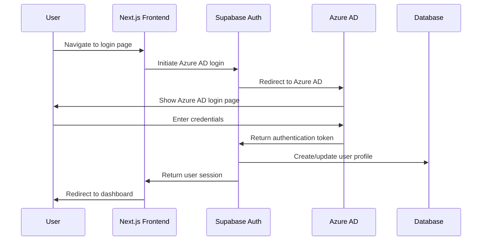
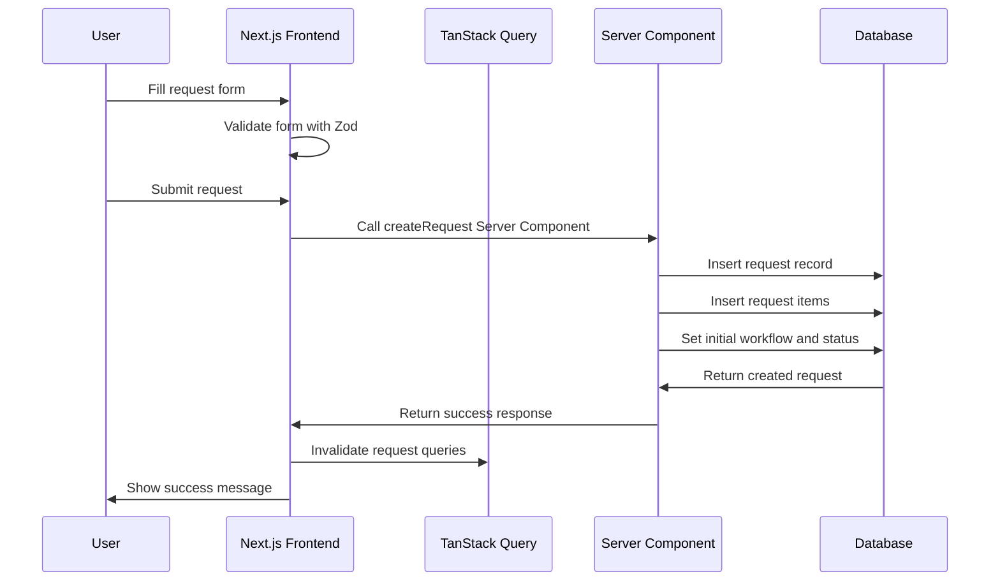

# School Request Management System - Core Workflows Document

## Change Log
| Date | Version | Description | Author |
|------|---------|-------------|--------|
| 2025-09-13 | 1.0 | Initial core workflows document creation | Architect |

## Core Workflows

The following sequence diagrams illustrate key system workflows that clarify the architecture decisions and complex interactions.

### User Authentication Workflow



### Request Creation Workflow



### Request Approval Workflow

```mermaid
sequenceDiagram
    participant U as Approver
    participant F as Next.js Frontend
    participant Q as TanStack Query
    participant SC as Server Component
    participant DB as Database

    U->>F: View pending requests
    F->>Q: Fetch requests requiring approval
    Q->>DB: Query requests with RLS
    DB->>Q: Return requests
    Q->>F: Update UI with requests
    U->>F: Select request to approve
    F->>SC: Call approveRequest Server Component
    SC->>DB: Update request status
    SC->>DB: Insert approval record
    SC->>DB: Update current step
    DB->>SC: Return updated request
    SC->>F: Return success response
    F->>Q: Invalidate request queries
    F->>U: Show success message